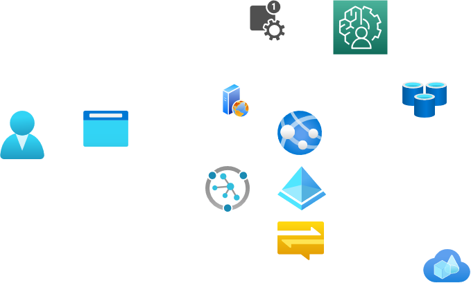

# Architettura

## Descrizione

In breve, avremo l'utente che punta ad una pagina web erogata da un server web statico.
Recupera html/css/... e li ci sarà modo di autenticarsi/registrarsi.
Una volta riconosciuto, verrà proposto all'utente se vuole fare una nuova partita, se vs giocatore, vs IA o altro.
Creata la partita le mosse dell'ia / giocatore remoto arriveranno tramite notifiche push, mentre il giocatore potrà segnalare le sue mosse tramite audio.
L'audio verrà analizzato da SaaS, trasformato in stringa, notificato a applicativo custom che "pulisce" il comando e poi propaga a chess engine.
La mossa successiva trovata dal chess engine sarà notificata al browser che "muoverà il pezzo".

## Grafico

[Edit](https://app.diagrams.net/?mode=github#Hxesoftproject%2Fpresentazione%2Fmaster%2Fdocs%2Farchitettura.png)

